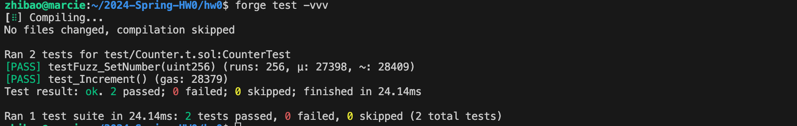
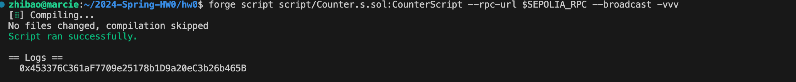
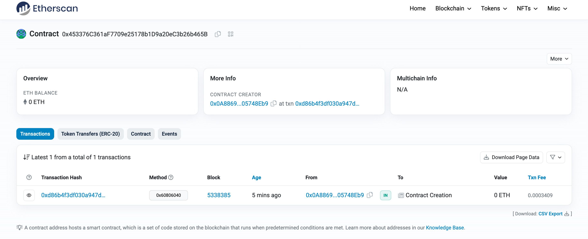

# 2024-Spring-HW0

All the detailed specified in Homework 0 documentation.

## Wallet Address
Please provide your MetaMask wallet address: 0x0A88694793C5b918a84242850ec2384F05748Eb9

## Local Testing
Please provide a screenshot of the `forge test -vvv` command running in your local environment.

## Contract Address
Please provide the contract address that you deployed on the Sepolia network.\
Contract Address : 0x453376C361aF7709e25178b1D9a20eC3b26b465B

## Sepolia Etherscan
Paste the contract address into the Sepolia Etherscan and share the screenshot.
